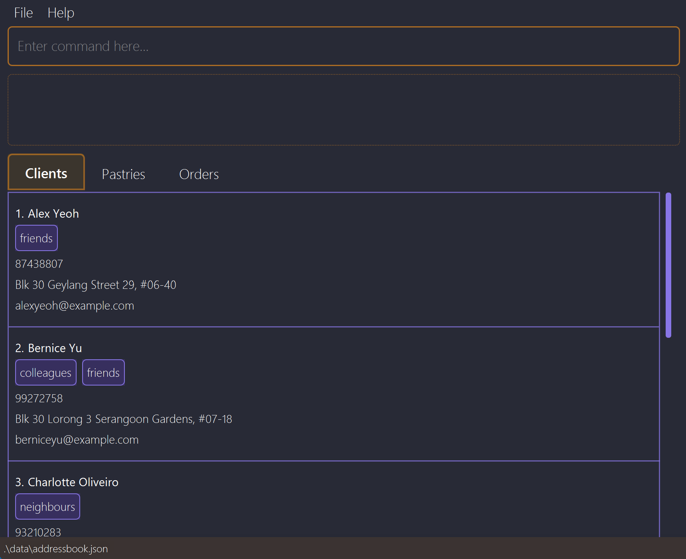
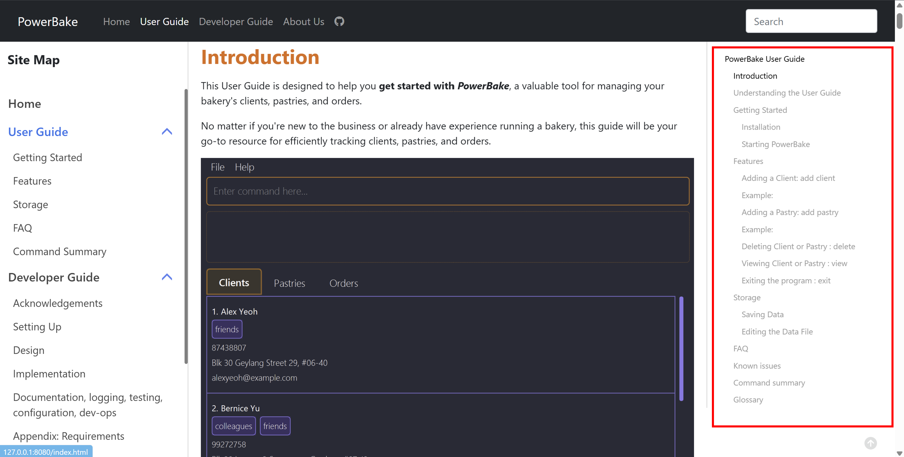
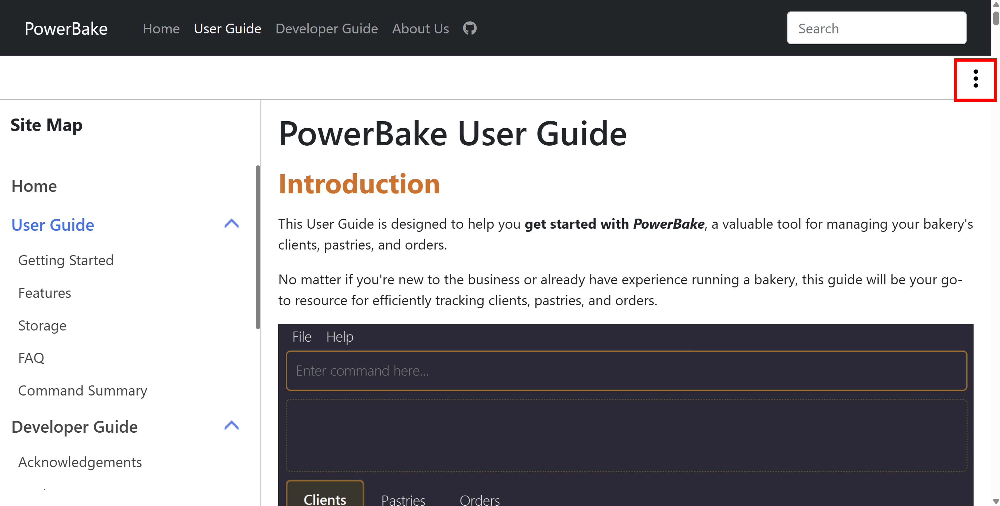
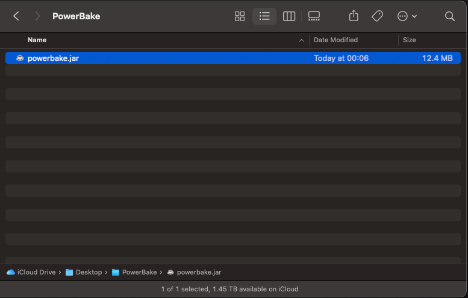
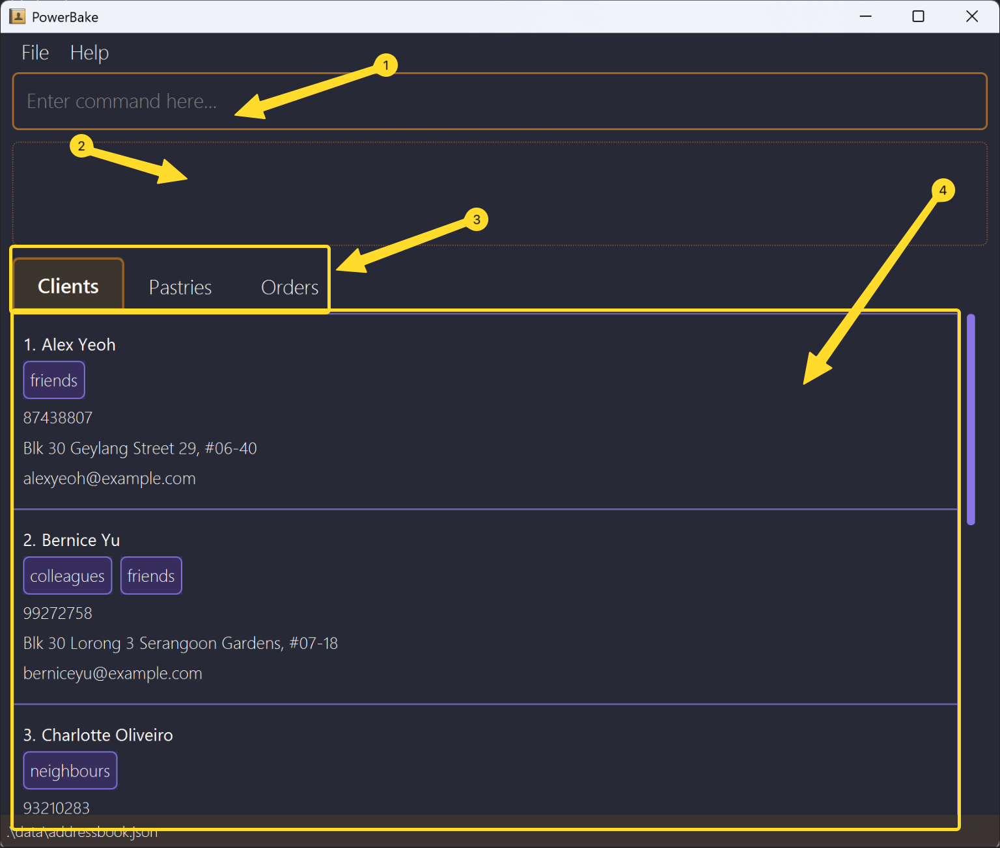
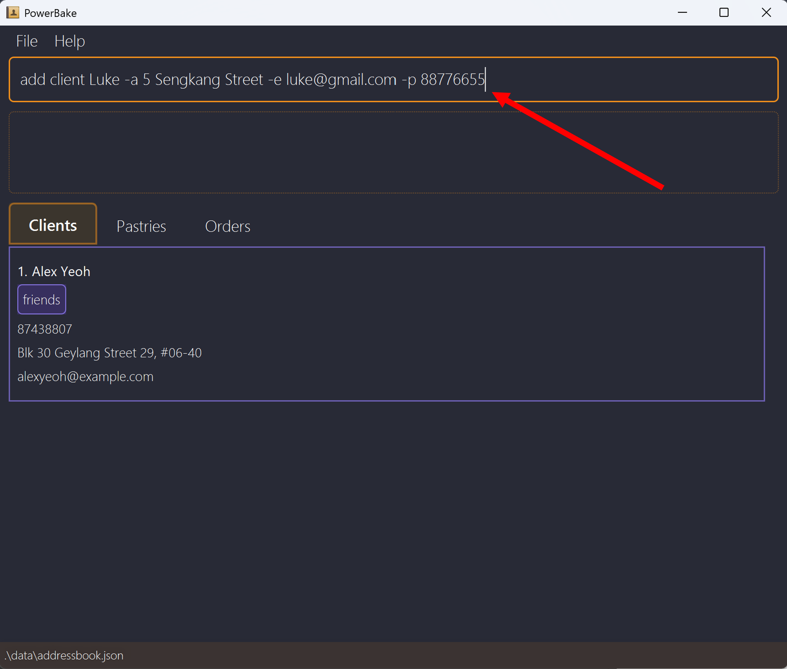
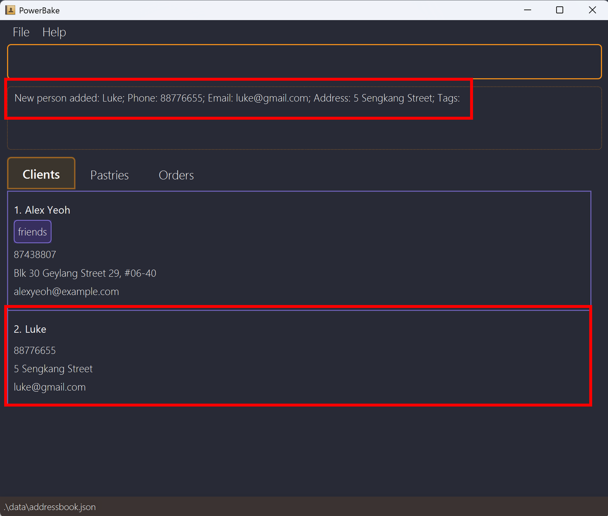
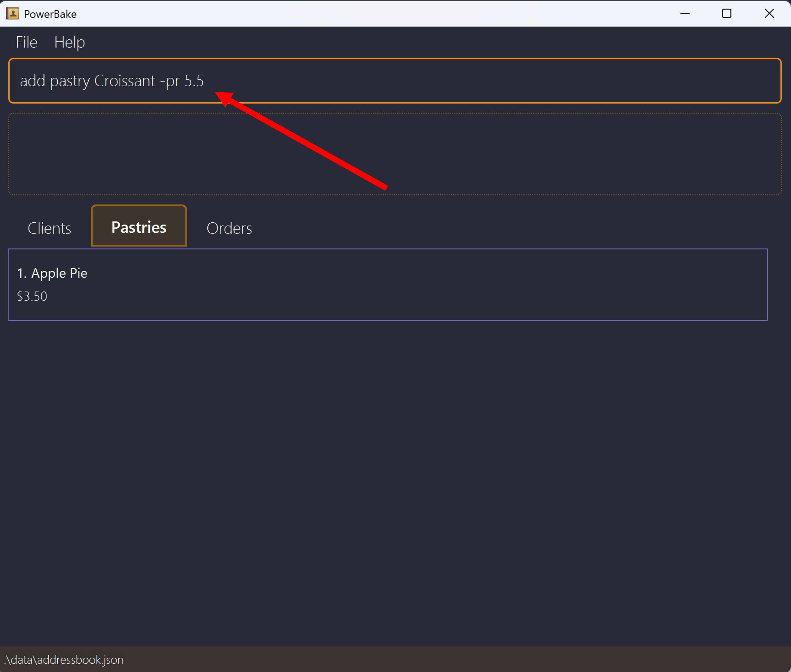
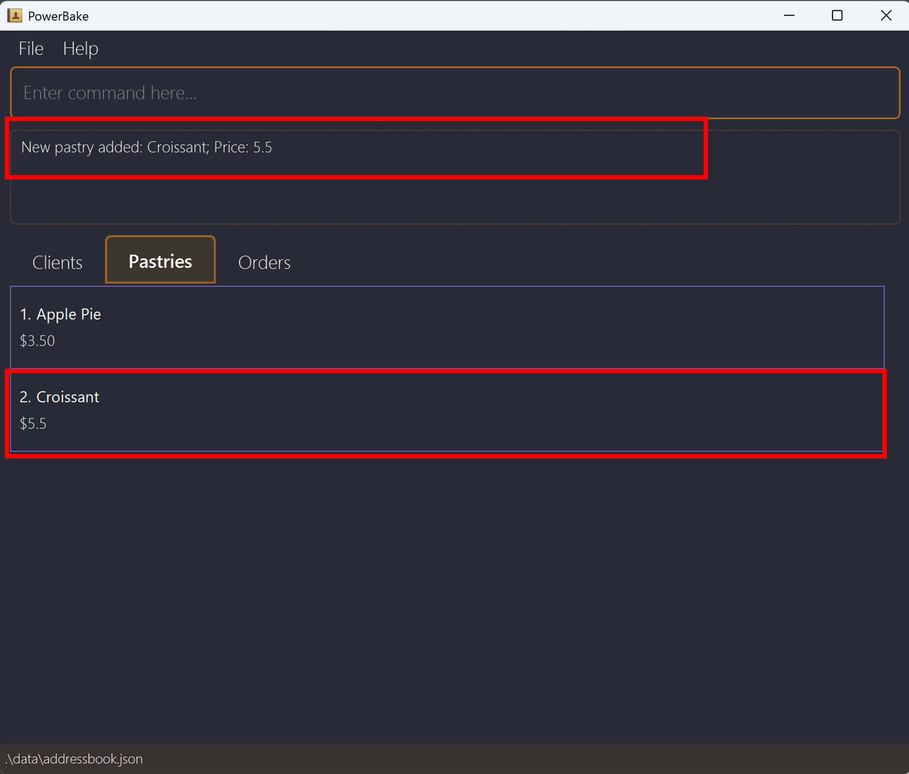

# PowerBake User Guide

<page-nav-print />

<div style="page-break-after: always;"></div>

## **Introduction**
This User Guide is designed to help you **get started with _PowerBake_**, a valuable tool for managing your bakery's clients, pastries, and orders. 

No matter if you're new to the business or already have experience running a bakery, this guide will be your go-to resource for efficiently tracking clients, pastries, and orders.



**_PowerBake_** is a **desktop application** designed to help small home bakery businesses **track clients, manage pastry inventory, and organize orders efficiently**.

To enhance speed and productivity, **_PowerBake_** is **optimized for a [Command Line Interface (CLI)](#glossary)** while still providing the benefits of a [Graphical User Interface (GUI)](#glossary). 

<box type="info" seamless>

If you type quickly, **_PowerBake_** helps you process orders and manage your business faster than traditional GUI-based applications.

</box>

Using **_PowerBake_**, you can efficiently manage your bakery with:

- **Quick Overview**: Instantly access client details, pastry inventory, and order statuses at a glance.
- **Order Tracking**: Keep track of each order's progress, from placement to delivery or pickup.


**_PowerBake_ is the perfect tool for small home bakery owners looking for a simple, efficient way to manage their business.**

#### Prerequisite Knowledge

This guide is designed to be accessible to all users, whether you’re a new or experienced user. 

If you are a **new _PowerBake_** user:

- Do refer to the [Glossary](#glossary) section to understand the key terminologies used in the guide.
- Check out our [Getting Started](#getting-started) section to get started with using **_PowerBake_**!

If you are an **experienced _PowerBake_** user:

- The [Command Summary](#command-summary) section provides a quick overview of all available commands in **_PowerBake_**.
- The [Features](#features) section can give more specific insight as to the features of **_PowerBake_** and each command.

Our goal is to make managing your bakery as smooth and efficient as possible, regardless of your level of experience. 

**For additional information**, you may refer to the [FAQ](#faq) section or the [Known Issues](#known-issues) section.

[Back to top](#user-guide)

__________________________________________________________________________________________________________________

<div style="page-break-after: always;"></div>

## **Understanding the User Guide**

This section outlines the various elements found in this guide and explains what they represent.

#### Navigating the Guide

To quickly jump between sections, use the **Page Navigation** menu located on the right side of the screen.



On smaller screens, the **Page Navigation** menu is hidden by default. To display it, simply click the three-dot icon in the upper right corner.



#### Hyperlinks

Curious about hyperlinks? [Learn more here!](#glossary)

[Hyperlinks are displayed in this style.](#links)

They can also appear [**in bold**](#links), [_in italics_](#links) or [**_both!_**](#links)

#### Code

`Any code shown within the guide will appear in this style.`

#### Code Blocks

```
/* Large blocks of code can 
*/ be displayed in this way as well
public static printCodeBlock (String code) {
  // do something
}
```

#### Information Boxes

<box>

This is an information box where additional details may be shared.

This guide uses three types of boxes:
* [Additional Information](#additional-information)
* [Warning](#warning)
* [Tips](#tips)
</box>

#### Additional Information

Additional information are shown as a box with a **"i"** symbol.

Here are some of the different styles of additional information you may see:

<box type="info">

This is an example of additional information.
</box>

<box type="info" light>

Here’s another version of additional information.
</box>

<box type="info" seamless>

And yet another style of additional information.
</box>

#### Warning

Warnings can are shown typically as a box with an exclaimation mark as a symbol. 

Here are some of the different styles of warnings you may see:

<box type="warning">

Warning! Please take caution!
</box>

<box type="warning" light>

Warning Warning! Be alert!
</box>

<box type="warning" seamless>

This is another warning style. Stay careful!
</box>

#### Tips

Similarly, tips are shows within a box with a lightbulb as its symbol. These are useful **optional information** and you may skip these without any consequence.

Here are some of the different styles of tips you may see:

<box type="tip">

Here are some useful tips. You can skip these if you're in a rush!
</box>

<box type="tip" light>

These are additional tips, presented in a lighter format.
</box>

<box type="tip" seamless>

And here’s another seamless format for tips.
</box>

[Return to top](#user-guide)

__________________________________________________________________________________________________________________

## Getting Started

Lets learn how to get started with **PowerBake**! This guide will walk you through on how to [**install the application**](#installation) and
[**how to use it**](#tutorial) to supercharge your baking experience!

<box header=" **By the end of this section, you will:**">

- Have PowerBake installed on your computer
- Understand how to run PowerBake
- Create your first Customer, Pastry and Order!
- Learn how to manage your Customers and Orders

</box>


--------------------------------------------------------------------------------------------------------------------

### Installation

1. Ensure you have Java `17` or above installed.

<box type="info" light>

**Dont Worry!** If you are not sure how to install java you can follow this [guide](https://www.java.com/en/download/help/download_options.html).
<br>**Mac users:** Ensure you have the precise JDK version prescribed [here](https://se-education.org/guides/tutorials/javaInstallationMac.html).

</box>

1. Download the **latest** `PowerBake.jar` file from our [Github's latest release](https://github.com/AY2425S2-CS2103T-F13-2/tp/releases/latest).

1. Find the file you have just downloaded. It is called `PowerBake.jar`.
    - The file is likely to be found in your `Downloads` folder.
    <br>([How to find the downloads folder](https://www.minitool.com/data-recovery/downloads-on-windows-mac-android-ios.html))

1. create a new folder to use as the [_home folder_](#glossary) for PowerBake.
    - it is recommended to use a new & empty folder to prevent any data loss.

    <box type="info" seamless>

        This folder can be created anywhere on your computer

    </box>

1. Copy the file to the newly created folder.

    <box type="info" seamless header="**How to copy the file into the new folder:**">

    1. Right click on PowerBake.jar and select **Copy**.

    1. **Navigate** to the newly created folder.

    1. Right click on the folder and select **Paste**.

    </box>

1. **At the end you should have a empty folder with the `PowerBake.jar` file in it similar to this:**

    |

--------------------------------------------------------------------------------------------------------------------

### Starting PowerBake

Now that you have installed PowerBake, lets learn how to launch it!

1. Open a [command terminal](#glossary)
    - **Windows:** open the start menu and search for `cmd` then press `Enter`
    - **MacOS:** open spotlight search and search for `Terminal` then press `Enter`

    <br>

    <box type="tip" seamless header="**How to use the terminal:**">

    If you are unsure about how to use the terminal you can follow this [guide](https://cs.colby.edu/maxwell/courses/tutorials/terminal).

    </box>

1. Navigate into the folder you created earlier.

    <box type="info" seamless header="**How to navigate into the folder:**">

    1. Open the command terminal.

    1. Type `cd ` (with a space after `cd`).

    1. Drag the folder into the terminal window.

    1. Press `Enter`.

    </box>

1. run the following command to start PowerBake:

    ```
    java -jar PowerBake.jar
    ```

1. After a breif moment, you should see a window similar to this:

    <box type="info" light>

    the first time you run PowerBake, it will contain [sample data](#glossary).<br>
    This helps you understand how the entries will appear and how the app will feel like when you start using it.

    </box>

    

Now that you have PowerBake running, lets learn how to use it to manage your customers and orders in this [tutorial!](#tutorial)

[Back to top](#powerbake-user-guide)

--------------------------------------------------------------------------------------------------------------------

## Features

This section explains the detailed list of commands and its usages which are available for you to use.

<box type="tip" seamless> 

If you are familiar with **_PowerBake_** and just need a **quick refresher** on the commands available, you can [click here](#command-summary) for the Command Summary below.

</box>

<box type="info" seamless>

**Notes about the command format:**<br>

* Words in `UPPER_CASE` are the parameters to be supplied by the user.<br>
  ```
   add client NAME -a ADDRESS -e EMAIL -p PHONE -t TAGS
  ```
  `NAME`, `ADDRESS`, `EMAIL`, `PHONE` and `TAGS` are parameters which are to be replaced:
  ```
   add client Luke -a 5 Punggol Street -e luke@gmail.com -p 88776655 -t client
  ```

* Words in `[Square Brackets]` are **optional parameters**.<br>
  ```
   add client NAME -a ADDRESS -e EMAIL -p PHONE [-t TAGS]
  ```
  `TAGS` is optional. You can use it like:
  ```
   add client Luke -a 5 Punggol Street -e luke@gmail.com -p 88776655 -t client
  ```
  OR
  ```
   add client Luke -a 5 Punggol Street -e luke@gmail.com -p 88776655
  ```
  
* Extraneous parameters for commands that do not take in parameters (`exit`) will be ignored.<br>
  e.g. if the command specifies `exit 123`, it will be interpreted as `exit`.
</box>


### Adding a Client: `add client`

The `add client` command is essential in keeping track of your client base.

It allows you to seamlessly add key details of your client into the record. These details will then be integrated into keeping track of orders in the future.

#### Command Usage
Command: `add client NAME -a ADDRESS -e EMAIL -p PHONE -t TAG`

<box type="info" seamless>

**Info:** TAG can be left blank, you can add as many tags as you want.

</box>

#### Parameters:

1. NAME: The name of your client.
   * Example: `Luke`, `James`
2. -a ADDRESS: The address of your client, 5 - 100 characters
    * Example: `5 Sengkang Street`
3. -e EMAIL: The email address of you client, follows valid format
    * Example: `luke@gmail.com`
4. -p PHONE: 8-digit phone number of your client
    * Example: `88776655`
5. -t TAG: Extra details of your client (Optional, any number of tags is allowed)
    * Example: `Spender`

### Example:
Adding a client, **Luke**, into Powerbake application. He lives at **5 Sengkang Street** and his email address is **luke@gmail.com**. His phone number is **88776655**.

To add luke, simply type:
`add client Luke -a 5 Sengkang Street -e luke@gmail.com -p 88776655`



Once `enter` is hit, a output message will be displayed of your success. His details will also be displayed under the client's tab. This allows you to easily keep track of client details systematically and efficiently.


### Adding a Pastry: `add pastry`

The `add pastry` command is essential in keeping track of your pastry menu.

It allows you to add key details of pastries. These details will then utilised when keeping track of pastry orders in the future.

#### Command Usage
Command: `add pastry NAME -pr PRICE`

#### Parameters:

1. NAME: The name of your pastry.
    * Example: `Croissant`
2. -pr PRICE: The price of your pastry, supports up to 2 decimal places.
    * Example: `5.50`, `5`

### Example:
Adding a pastry, **Croissant**, into PowerBake application. Price is 5.50.

To add the Croissant, simply type
`add pastry Croissant -pr 5.5`



Once `enter` is hit, a output message will be displayed of your success. Pastry details will also be displayed under the pastry's tab. This allows you to easily keep track of pastry details systematically and efficiently.


[Go to Command Summary](#command-summary)

---

### Deleting Client or Pastry : `delete`

The `delete` command is an essential tool in PowerBake, as it helps you maintain a clean and relevant list of clients and pastries.

#### Command Usage

**Command**: `delete client/pastry INDEX`

#### Parameters:

* **INDEX**: Represents position of the client/pastry list that you wish to remove.

<box type="info" seamless>

The `INDEX` should be positive integer. For instance: `1`, `2`, etc. </br>
This corresponds to the position of the client/pastry displayed in list.

</box>

##### Example 1:
If you want to remove the fifth **client** on the list, the command would look like this:

```
 delete client 5
```

**Before:**


After hitting `Enter`, you will see the fifth client removed from the list.
The remaining pastries will adjust their index numbers accordingly.

**After:**


##### Example 2:
If you want to remove the second **pastry** on the list, the command would look like this:

```
 delete pastry 2
```

**Before:**


After hitting `Enter`, you will see the second pastry removed from the list.
The remaining pastries will adjust their index numbers accordingly.

**After:**


[Go to Command Summary](#command-summary)

---

### Viewing Client or Pastry : `view`

The `view` command offers a detailed insight of the client and pastry list.

An in-depth look to access client information easily, or to access the types of pastries available.

#### Command Usage

**Command**: `view client/pastry`

#### Parameters:

* **client**: Access the client list.
* **pastry**: Access the pastry list.

<box type="info" seamless>

The `view` command allows only either viewing client or viewing pastry.

</box>

##### Example 1:
If you wish to view the **client** details, the command would be:

```
 view client
```


After hitting `Enter`, you will see the client details being displayed on the GUI. </br>
Here, you can observe all the details regarding client, such as their name, address, email address, phone number and tag.

##### Example 2:
If you wish to view the **pastry** details, the command would be:

```
 view pastry
```


After hitting `Enter`, you will see the pastry details being displayed on the GUI. </br>
Here, you can observe all the details regarding pastry, such as the name and the price of the pastry.

<box type="tip" seamless>

Alternatively, you can switch between **client** and **pastry** by utilising the GUI button.


</box>

[Go to Command Summary](#command-summary)

---


### Exiting the program : `exit`

The `exit` command is designed to let you have a swift way of **closing PowerBake**.

It is a simple command, where the application terminates gracefully while safeguarding all the data and changes you have made.

#### Command Usage

**Command**: `exit`

#### Parameters:

<box type="info" seamless>

The `exit` command does not require any parameters.

</box>

[Go to Command Summary](#command-summary)

---

### Saving the data

AddressBook data are saved in the hard disk automatically after any command that changes the data. There is no need to save manually.

### Editing the data file

AddressBook data are saved automatically as a JSON file `[JAR file location]/data/addressbook.json`. Advanced users are welcome to update data directly by editing that data file.

<box type="warning" seamless>

**Caution:**
If your changes to the data file makes its format invalid, AddressBook will discard all data and start with an empty data file at the next run.  Hence, it is recommended to take a backup of the file before editing it.<br>
Furthermore, certain edits can cause the AddressBook to behave in unexpected ways (e.g., if a value entered is outside the acceptable range). Therefore, edit the data file only if you are confident that you can update it correctly.
</box>

## Storage 

This section will go through how order, pastry and customer details are stored.

### Saving Data

*PowerBake* data is saved automatically after any command that adds, deletes or edit. There is no need for any manual saving.


### Editing the Data File 
**CAUTION:**
Adding data in the wrong format could lead to potential errors.

*PowerBake* data is saved in [FILE LOCATION]/data/addressbook.json, experienced users can add or delete clients and pastries within the json file.


--------------------------------------------------------------------------------------------------------------------

## FAQ

**Q**: How do I transfer my data to another Computer?<br>
**A**: Install the app in the other computer and overwrite the empty data file it creates with the file that contains the data of your previous AddressBook home folder.

--------------------------------------------------------------------------------------------------------------------

## Known issues

1. **When using multiple screens**, if you move the application to a secondary screen, and later switch to using only the primary screen, the GUI will open off-screen. The remedy is to delete the `preferences.json` file created by the application before running the application again.
2. **If you minimize the Help Window** and then run the `help` command (or use the `Help` menu, or the keyboard shortcut `F1`) again, the original Help Window will remain minimized, and no new Help Window will appear. The remedy is to manually restore the minimized Help Window.

--------------------------------------------------------------------------------------------------------------------

## Command summary
| Command                                                | Usage                                                  | Example                                                                       |
|--------------------------------------------------------|--------------------------------------------------------|-------------------------------------------------------------------------------|
| **[Add Client](#adding-a-client-add-client)**          | `add client NAME -a ADDRESS -e EMAIL -p PHONE -t TAGS` | `add client Luke -a 5 Punggol Street -e luke@gmail.com -p 88776655 -t client` |
| **[Add Pastry](#adding-a-pastry-add-pastry)**          | `add pastry NAME -pr PRICE`                            | `add pastry Tart -pr 3.40`                                                    |
| **[Delete Client](#deleting-client-or-pastry-delete)** | `delete client INDEX`                                  | `delete client 1`                                                             |
| **[Delete Pastry](#deleting-client-or-pastry-delete)** | `delete pastry INDEX`                                  | `delete pastry 1`                                                             |
| **[View Client](#viewing-client-or-pastry-view)**      | `view client`                                          | `view client`                                                                 |
| **[View Pastry](#viewing-client-or-pastry-view)**      | `view pastry`                                          | `view pastry`                                                                 |
| **[Exit](#exiting-the-program-exit)**                  | `exit`                                                 | `exit`                                                                        |

--------------------------------------------------------------------------------------------------------------------

## Glossary

| Term                              | Explanation                                                                                                                                                                                                    |
|-----------------------------------|----------------------------------------------------------------------------------------------------------------------------------------------------------------------------------------------------------------|
| Client/Customer                   | A client/customer in a bakery is a regular or business customer who places orders for baked goods, often in bulk or on a recurring basis.                                                                      |
| Command                           | A user input that directs LetsGetHired to carry out a particular action.                                                                                                                                       |
| Command Line Interface (CLI)      | An interface where users interact with a system by entering text commands into a terminal or console.                                                                                                          |
| Command Terminal                  | A text-based interface for interacting with the computer. Examples include the Command Prompt on Windows, Terminal on macOS, and bash on Linux.                                                                |
| Graphical User Interface (GUI)    | An interface that enables users to engage with a system using visual elements like icons and other graphical indicators.                                                                                       |
| Home folder                       | The folder where Powerbake's' is saved. The home folder is used to store data files used by Powerbake.                                                                                                         |
| Hyperlink                         | A clickable reference on a webpage that directs users to another location or file, either on the same page or a different one.                                                                                 |
| JSON (JavaScript Object Notation) | A simple, human-readable data format used for data exchange that is easily parsed and generated by machines.                                                                                                   |
| Local storage                     | Local storage in an application refers to a method of storing data on a user's device, allowing the application to save information persistently without requiring a server connection.                        |
| Mainstream OS                     | Mainstream operating systems such as Windows and macOS.                                                                                                                                                        |
| Orders                            | Orders in a bakery refer to customer requests for specific baked goods, either for immediate purchase or scheduled pickup/delivery, often including custom or bulk requests.                                   |
| Parameter                         | A variable in a command that stands in for a specific piece of information that must be supplied when the command is executed.                                                                                 |
| Pastries                          | Pastries in a bakery refer to baked goods made from dough or batter, often enriched with butter, sugar, and fillings like cream, fruit, or chocolate, including items such as croissants, danishes, and tarts. |
