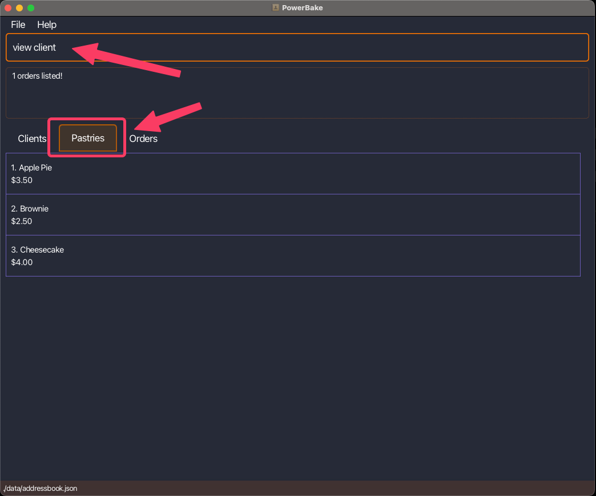
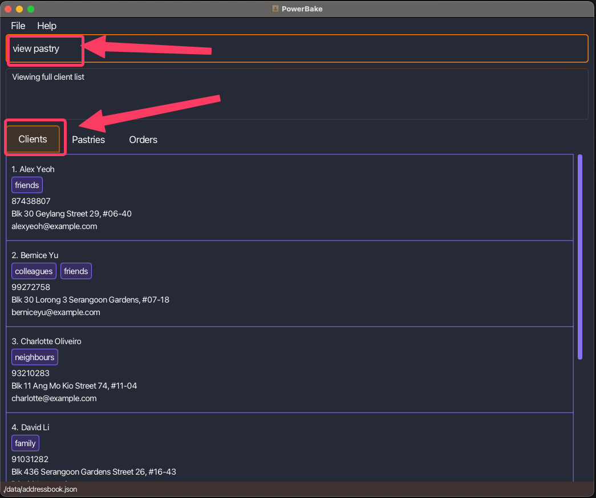
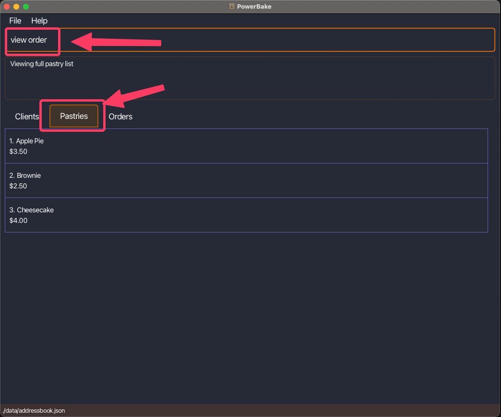

# AB-3 User Guide

AddressBook Level 3 (AB3) is a **desktop app for managing contacts, optimized for use via a  Line Interface** (CLI) while still having the benefits of a Graphical User Interface (GUI). If you can type fast, AB3 can get your contact management tasks done faster than traditional GUI apps.

<!-- * Table of Contents -->
<page-nav-print />

--------------------------------------------------------------------------------------------------------------------

## Quick start

1. Ensure you have Java `17` or above installed in your Computer.<br>
   **Mac users:** Ensure you have the precise JDK version prescribed [here](https://se-education.org/guides/tutorials/javaInstallationMac.html).

1. Download the latest `.jar` file from [here](https://github.com/se-edu/addressbook-level3/releases).

1. Copy the file to the folder you want to use as the _home folder_ for your AddressBook.

1. Open a command terminal, `cd` into the folder you put the jar file in, and use the `java -jar addressbook.jar` command to run the application.<br>
   A GUI similar to the below should appear in a few seconds. Note how the app contains some sample data.<br>
   

1. Type the command in the command box and press Enter to execute it. e.g. typing **`help`** and pressing Enter will open the help window.<br>
   Some example commands you can try:

   * `list` : Lists all contacts.

   * `add n/John Doe p/98765432 e/johnd@example.com a/John street, block 123, #01-01` : Adds a contact named `John Doe` to the Address Book.

   * `delete 3` : Deletes the 3rd contact shown in the current list.

   * `clear` : Deletes all contacts.

   * `exit` : Exits the app.

1. Refer to the [Features](#features) below for details of each command.

--------------------------------------------------------------------------------------------------------------------

## Commands

This section explains the detailed list of commands and its usages which are available for you to use.

<box type="tip" seamless> 

If you are familiar with **_PowerBake_** and just need a **quick refresher** on the commands available, you can [click here](#command-summary) for the Command Summary below.

</box>

<box type="info" seamless>

**Notes about the command format:**<br>

* Words in `UPPER_CASE` are the parameters to be supplied by the user.<br>
  ```
   add client NAME -a ADDRESS -e EMAIL -p PHONE -t TAGS
  ```
  `NAME`, `ADDRESS`, `EMAIL`, `PHONE` and `TAGS` are parameters which are to be replaced:
  ```
   add client Luke -a 5 Punggol Street -e luke@gmail.com -p 88776655 -t client
  ```

* Words in `[Square Brackets]` are **optional parameters**.<br>
  ```
   add client NAME -a ADDRESS -e EMAIL -p PHONE [-t TAGS]
  ```
  `TAGS` is optional. You can use it like:
  ```
   add client Luke -a 5 Punggol Street -e luke@gmail.com -p 88776655 -t client
  ```
  OR
  ```
   add client Luke -a 5 Punggol Street -e luke@gmail.com -p 88776655
  ```
  
* Extraneous parameters for commands that do not take in parameters (`exit`) will be ignored.<br>
  e.g. if the command specifies `exit 123`, it will be interpreted as `exit`.
</box>

### Deleting Client or Pastry : `delete`

The `delete` command is an essential tool in PowerBake, as it helps you maintain a clean and relevant list of clients and pastries.

#### Command Usage

**Command**: `delete client/pastry INDEX`

#### Parameters:

* **INDEX**: Represents position of the client/pastry list that you wish to remove.

<box type="info" seamless>

The `INDEX` should be positive integer. For instance: `1`, `2`, etc. </br>
This corresponds to the position of the client/pastry displayed in list.

</box>

##### Example 1:
If you want to remove the fifth **client** on the list, the command would look like this:

```
 delete client 5
```

**Before:**


After hitting `Enter`, you will see the fifth client removed from the list.
The remaining pastries will adjust their index numbers accordingly.

**After:**


##### Example 2:
If you want to remove the second **pastry** on the list, the command would look like this:

```
 delete pastry 2
```

**Before:**


After hitting `Enter`, you will see the second pastry removed from the list.
The remaining pastries will adjust their index numbers accordingly.

**After:**


[Go to Command Summary](#command-summary)

---

### Viewing Client or Pastry : `view`

The `view` command offers a detailed insight of the client and pastry list.

An in-depth look to access client information easily, or to access the types of pastries available.

#### Command Usage

**Command**: `view client/pastry`

#### Parameters:

* **client**: Access the client list.
* **pastry**: Access the pastry list.

<box type="info" seamless>

The `view` command allows only either viewing client or viewing pastry.

</box>

##### Example 1:
If you wish to view the **client** details, the command would be:

```
 view client
```



After hitting `Enter`, you will see the client details being displayed on the GUI. </br>
Here, you can observe all the details regarding client, such as their name, address, email address, phone number and tag.

##### Example 2:
If you wish to view the **pastry** details, the command would be:

```
 view pastry
```



After hitting `Enter`, you will see the pastry details being displayed on the GUI. </br>
Here, you can observe all the details regarding pastry, such as the name and the price of the pastry.

<box type="tip" seamless>

Alternatively, you can switch between **client** and **pastry** by utilising the GUI button.



</box>

[Go to Command Summary](#command-summary)

---

### Exiting the program : `exit`

The `exit` command is designed to let you have a swift way of **closing PowerBake**.

It is a simple command, where the application terminates gracefully while safeguarding all the data and changes you have made.

#### Command Usage

**Command**: `exit`

#### Parameters:

<box type="info" seamless>

The `exit` command does not require any parameters.

</box>

[Go to Command Summary](#command-summary)

---

### Saving the data

AddressBook data are saved in the hard disk automatically after any command that changes the data. There is no need to save manually.

### Editing the data file

AddressBook data are saved automatically as a JSON file `[JAR file location]/data/addressbook.json`. Advanced users are welcome to update data directly by editing that data file.

<box type="warning" seamless>

**Caution:**
If your changes to the data file makes its format invalid, AddressBook will discard all data and start with an empty data file at the next run.  Hence, it is recommended to take a backup of the file before editing it.<br>
Furthermore, certain edits can cause the AddressBook to behave in unexpected ways (e.g., if a value entered is outside the acceptable range). Therefore, edit the data file only if you are confident that you can update it correctly.
</box>

### Archiving data files `[coming in v2.0]`

_Details coming soon ..._

--------------------------------------------------------------------------------------------------------------------

## FAQ

**Q**: How do I transfer my data to another Computer?<br>
**A**: Install the app in the other computer and overwrite the empty data file it creates with the file that contains the data of your previous AddressBook home folder.

--------------------------------------------------------------------------------------------------------------------

## Known issues

1. **When using multiple screens**, if you move the application to a secondary screen, and later switch to using only the primary screen, the GUI will open off-screen. The remedy is to delete the `preferences.json` file created by the application before running the application again.
2. **If you minimize the Help Window** and then run the `help` command (or use the `Help` menu, or the keyboard shortcut `F1`) again, the original Help Window will remain minimized, and no new Help Window will appear. The remedy is to manually restore the minimized Help Window.

--------------------------------------------------------------------------------------------------------------------

## Command summary
| Command                                                | Usage                                                  | Example                                                                       |
|--------------------------------------------------------|--------------------------------------------------------|-------------------------------------------------------------------------------|
| **[Add Client]**                                       | `add client NAME -a ADDRESS -e EMAIL -p PHONE -t TAGS` | `add client Luke -a 5 Punggol Street -e luke@gmail.com -p 88776655 -t client` |
| **[Add Pastry]**                                       | `add pastry NAME -pr PRICE`                            | `add pastry Tart -pr 3.40`                                                    |
| **[Delete Client](#deleting-client-or-pastry-delete)** | `delete client INDEX`                                  | `delete client 1`                                                             |
| **[Delete Pastry](#deleting-client-or-pastry-delete)** | `delete pastry INDEX`                                  | `delete pastry 1`                                                             |
| **[View Client]**                                      | `view client`                                          | `view client`                                                                 |
| **[View Pastry]**                                      | `view pastry`                                          | `view pastry`                                                                 |

